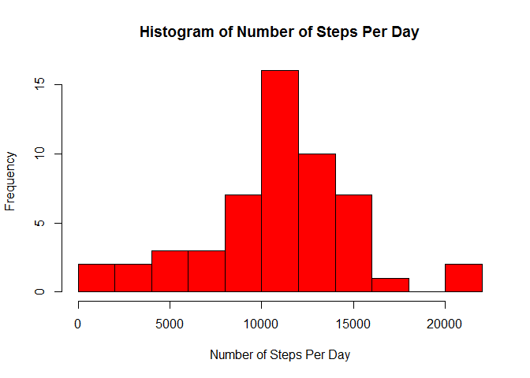
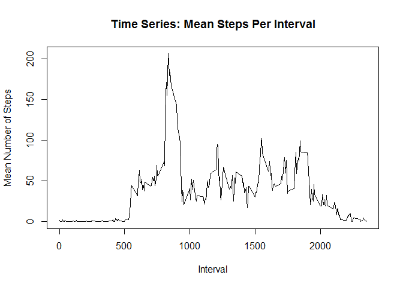
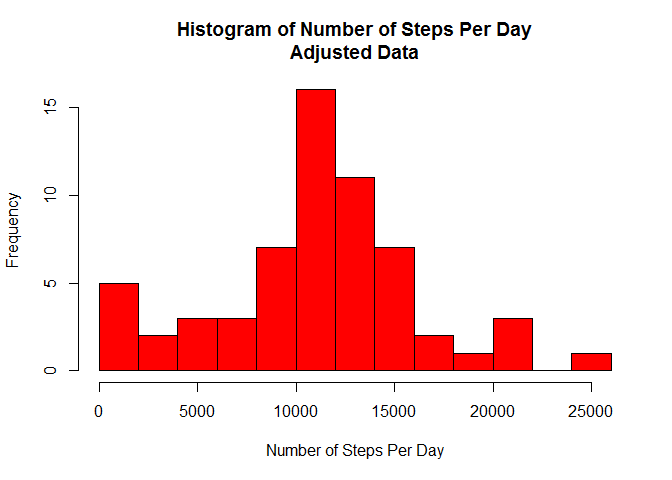
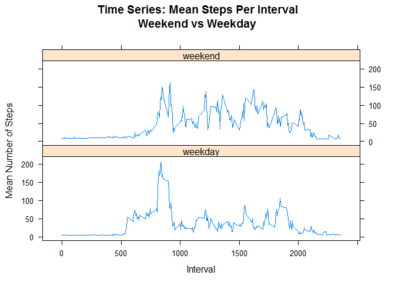

# Reproducible Research: Peer Assessment 1


## Loading and preprocessing the data
__Show any code that is needed to__

__1. Load the data (i.e. read.csv())__

__2. Process/transform the data (if necessary) into a format suitable for your analysis__


```r
dataIn<-read.csv('activity.csv')
```

## What is mean total number of steps taken per day?
__For this part of the assignment, you can ignore the missing values in the dataset.__

__1. Calculate the total number of steps taken per day.__


```r
dataSum<-aggregate(dataIn$steps~dataIn$date,FUN=sum,na.rm=TRUE,na.action=na.omit)
names(dataSum)<-c('date','sumSteps')
dataSum
```

```
##          date sumSteps
## 1  2012-10-02      126
## 2  2012-10-03    11352
## 3  2012-10-04    12116
## 4  2012-10-05    13294
## 5  2012-10-06    15420
## 6  2012-10-07    11015
## 7  2012-10-09    12811
## 8  2012-10-10     9900
## 9  2012-10-11    10304
## 10 2012-10-12    17382
## 11 2012-10-13    12426
## 12 2012-10-14    15098
## 13 2012-10-15    10139
## 14 2012-10-16    15084
## 15 2012-10-17    13452
## 16 2012-10-18    10056
## 17 2012-10-19    11829
## 18 2012-10-20    10395
## 19 2012-10-21     8821
## 20 2012-10-22    13460
## 21 2012-10-23     8918
## 22 2012-10-24     8355
## 23 2012-10-25     2492
## 24 2012-10-26     6778
## 25 2012-10-27    10119
## 26 2012-10-28    11458
## 27 2012-10-29     5018
## 28 2012-10-30     9819
## 29 2012-10-31    15414
## 30 2012-11-02    10600
## 31 2012-11-03    10571
## 32 2012-11-05    10439
## 33 2012-11-06     8334
## 34 2012-11-07    12883
## 35 2012-11-08     3219
## 36 2012-11-11    12608
## 37 2012-11-12    10765
## 38 2012-11-13     7336
## 39 2012-11-15       41
## 40 2012-11-16     5441
## 41 2012-11-17    14339
## 42 2012-11-18    15110
## 43 2012-11-19     8841
## 44 2012-11-20     4472
## 45 2012-11-21    12787
## 46 2012-11-22    20427
## 47 2012-11-23    21194
## 48 2012-11-24    14478
## 49 2012-11-25    11834
## 50 2012-11-26    11162
## 51 2012-11-27    13646
## 52 2012-11-28    10183
## 53 2012-11-29     7047
```

__2. If you do not understand the difference between a histogram and a barplot, research the difference between them. Make a histogram of the total number of steps taken each day.__


```r
hist(dataSum$sumSteps, breaks=8,
     main='Histogram of Number of Steps Per Day',
     xlab='Number of Steps Per Day',
     ylab='Frequency',
     border='black',col='red')
```

 

__3. Calculate and report the mean and median of the total number of steps taken per day__


```r
stepsDay<-dataSum$sumSteps
meanSteps=mean(stepsDay)
medianSteps=median(stepsDay)
```
The mean number of steps taken per day is 
**10,766**
and the median number is
**10,765**.

##What is the average daily activity pattern?

__1. Make a time series plot (i.e. type = "l") of the 5-minute interval (x-axis) and the average number of steps taken, averaged across all days (y-axis)__


```r
dataTS<-aggregate(dataIn$steps,by=list(dataIn$interval),mean,na.rm=TRUE)
names(dataTS)<-c('interval','meanSteps')
plot(dataTS, type='l', main='Time Series: Mean Steps Per Interval',
     xlab='Interval', ylab='Mean Number of Steps')
```

 

__2. Which 5-minute interval, on average across all the days in the dataset, contains the maximum number of steps?__

```r
maxData<-sapply(dataTS,max,na.rm=TRUE)
maxInterval<-maxData[1]
maxSteps<-maxData[2]
```

The interval with the greatest average number of steps is 
**2,355**
with
**206.17** steps.

## Imputing missing values

__Note that there are a number of days/intervals where there are missing values (coded as NA). The presence of missing days may introduce bias into some calculations or summaries of the data.__

__1. Calculate and report the total number of missing values in the dataset (i.e. the total number of rows with NAs)__


```r
numNA<-length(dataIn[is.na(dataIn$steps)==TRUE,1])
```

There are **2304** rows with NA (missing) values.

__2. Devise a strategy for filling in all of the missing values in the dataset. The strategy does not need to be sophisticated. For example, you could use the mean/median for that day, or the mean for that 5-minute interval, etc.__

Since people are creatures of habit, I went under the assumption that they keep to a somewhat regular routine. I used the mean for the 5-minute interval in place of any missing data.

__3. Create a new dataset that is equal to the original dataset but with the missing data filled in.__


```r
dataAdj<-dataIn
intervalMeans<-aggregate(dataIn$steps,list(dataIn$interval),
  na.rm=TRUE,FUN=mean)
intervalMeansRound<-round(intervalMeans)
names(intervalMeansRound)<-c('interval','steps')

mergeData<-merge(x=dataAdj,y=intervalMeansRound,by='interval',suffixes=c('.dataAdj','.intervalMeansRound'))
idx<-which(is.na(dataAdj$steps))
dataAdj[idx,'steps']<-mergeData[idx,'steps.intervalMeansRound']
```

__4. Make a histogram of the total number of steps taken each day and Calculate and report the mean and median total number of steps taken per day. Do these values differ from the estimates from the first part of the assignment? What is the impact of imputing missing data on the estimates of the total daily number of steps?__


```r
dataSum<-aggregate(dataAdj$steps,by=list(dataAdj$date),sum)
names(dataSum)<-c('date','sumSteps')

hist(dataSum$sumSteps, breaks=9,
     main='Histogram of Number of Steps Per Day\nAdjusted Data',
     xlab='Number of Steps Per Day',
     ylab='Frequency',
     border='black',col='red')
```

 

```r
stepsDay<-dataSum$sumSteps
meanSteps=mean(stepsDay)
medianSteps=median(stepsDay)
```
Using the adjusted data set, the mean number of steps taken per day is 
**10,889**
and the median number is
**11,015**.
The impact of these adjustments increases the mean (from 10,766 to 10,889) and the median (from 10,765 to 11,015) of the total number of steps per day.

##Are there differences in activity patterns between weekdays and weekends?

__For this part the weekdays() function may be of some help here. Use the dataset with the filled-in missing values for this part.__

__1. Create a new factor variable in the dataset with two levels - "weekday" and "weekend" indicating whether a given date is a weekday or weekend day.__


```r
library(plyr)
```

```
## Warning: package 'plyr' was built under R version 3.2.2
```

```r
dataAdj<-cbind(dataAdj,weekdays(as.Date(dataAdj$date),abbreviate=TRUE))
colnames(dataAdj)[4]<-'day'
dataAdj$day<-mapvalues(dataAdj$day,from=c('Mon','Tue','Wed','Thu','Fri','Sat','Sun'),to=c(rep('weekday',5),rep('weekend',2)))
```

__2. Make a panel plot containing a time series plot (i.e. type="l") of the 5-minute interval (x-axis) and the average number of steps taken, averaged across all weekday days or weekend days (y-axis). See the README file in the GitHub repository to see an example of what this plot should look like using simulated data.__


```r
library(lattice)
dataTS<-aggregate(dataAdj$steps,by=list(dataAdj$interval,dataAdj$day),mean,na.rm=TRUE)
names(dataTS)<-c('interval','day','meanSteps')
xyplot(meanSteps~interval|day,data=dataTS,type='l',layout=c(1,2),main='Time Series: Mean Steps Per Interval\nWeekend vs Weekday',xlab='Interval',ylab='Mean Number of Steps')
```

 

The weekday average begins to climb earlier in the day (at an earlier interval). This is most likely due to the subject beginning their workday. Both weekends and weekdays peak at about interval 900. After that the weekday average per interval drops, whereas the average on weekends tends to be higher, until (approximately) interval 1900, where the weekday average appears slightly higher then trails off. The weekend averages higher at interval 2000 before dropping off, showing more activity later in the evening.
